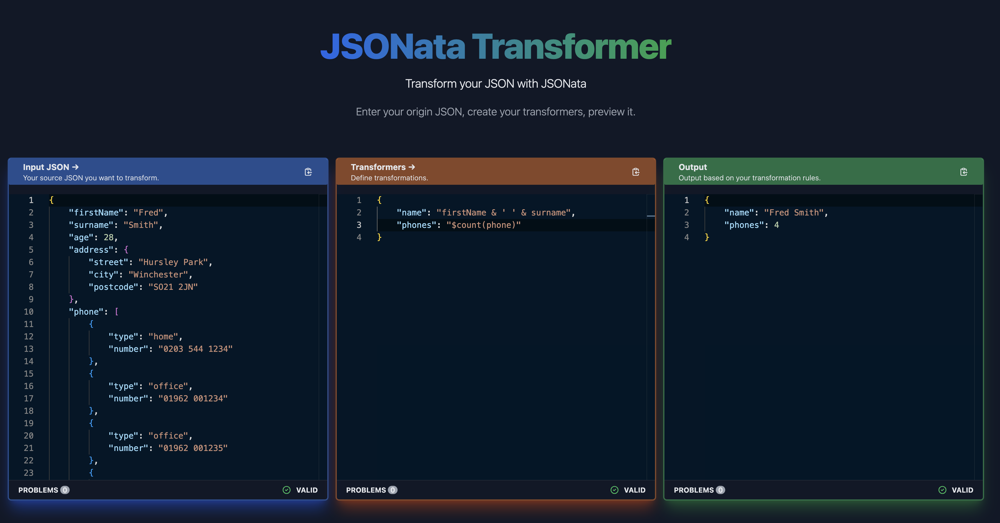

<h2>JSONata Transformer 🤖</h2>

Test your JSONata transformers on the fly.</>

[![MIT License][license-badge]][license]
[![PRs Welcome][prs-badge]][prs]

[![Watch on GitHub][github-watch-badge]][github-watch]
[![Star on GitHub][github-star-badge]][github-star]

<h3>Features: Preview output JSON based on your JSONata transformers, validation and errors on the fly, and more...</h3>

# The problem

Maybe you heard about [JSONata](https://jsonata.org/). If you didn't hear about it, it's a JSON query and transformation language

It's powerful and you can do a lot of things with it. Basically you can do [everything you can imagine](https://docs.jsonata.org)

You can [try it here](https://try.jsonata.org/) to see its power

The _problem_ is that maybe you want to see how it's going to be a JSON transformed using this framework

# This solution

JSONata Transformer uses custom editors to help you build your `Transformers` using JSONata functions and queries

You use a JSON as the input and you create a JSON structure with JSONata functions and queries on it

You can see the output in the Output box 

_This project is experimental any problems are issues feel free to raise GitHub issues or just reach out.._

# Getting Started

1. Visit [https://rubenjgarcia.github.io/jsonata-transformer-ui](https://https://rubenjgarcia.github.io/jsonata-transformer-ui).

2. Paste your JSON into the "Input JSON" editor.

3. Create a new JSON using JSONata transformers based on your input.

4. Once you are happy with your transformers you can quickly copy the result to clipboard using the editor icons.

# Contributing

This project is inspired by [Amazon Eventbridge Transformer](https://github.com/boyney123/eventbridge-transformer)

If you have any questions, features or issues please raise any issue or pull requests you like. I will try my best to get back to you.

[license-badge]: https://img.shields.io/github/license/rubenjgarcia/jsonata-transformer-ui.svg?color=yellow
[license]: https://github.com/rubenjgarcia/jsonata-transformer-ui/blob/main/LICENCE
[prs-badge]: https://img.shields.io/badge/PRs-welcome-brightgreen.svg?style=flat-square
[prs]: http://makeapullrequest.com
[github-watch-badge]: https://img.shields.io/github/watchers/rubenjgarcia/jsonata-transformer-ui.svg?style=social
[github-watch]: https://github.com/rubenjgarcia/jsonata-transformer-ui/watchers
[github-star-badge]: https://img.shields.io/github/stars/rubenjgarcia/jsonata-transformer-ui.svg?style=social
[github-star]: https://github.com/rubenjgarcia/jsonata-transformer-ui/stargazers

# License

MIT.
